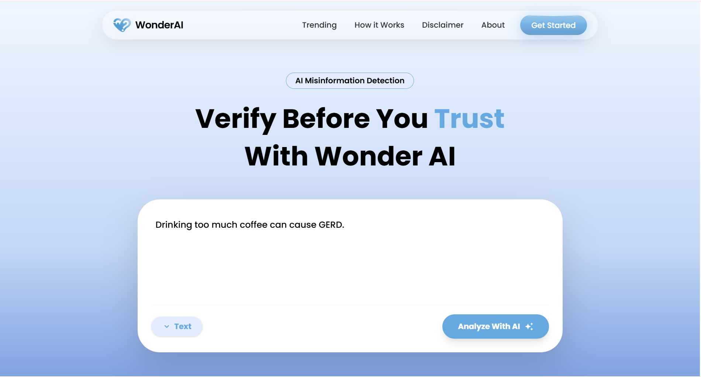

#  TruthGuard

**TruthGuard** is an intelligent web-based platform designed to detect misinformation and analyze news credibility using advanced Artificial Intelligence.

This project was built specifically for the **Octopus Hackathon (Global AI Hackathon)** with the mission of creating a digital shield against the spread of hoaxes and fake news in the digital age.

## 📖 About The Project

In the modern digital era, information spreads faster than it can be verified. TruthGuard bridges this gap by leveraging Generative AI and global fact-checking databases. The TruthGuard system provides users with:

1. **Real-time AI Analysis:** Instantly analyzes text or URLs to detect logical fallacies, sarcasm, and potential misinformation patterns.
2. **Global Trending Insights:** Monitors and displays trending hoaxes that have been debunked by international fact-checking organizations.

## 🚀 Key Features

* **🔍 Instant Truth Analysis:** Input any news text or URL to receive an immediate **Verdict** (Factual/Misinformation/Satire) along with a **Confidence Score** and logical explanation.
* **🌍 Trending Misinformation:** Integrates live data from the **Google Fact Check Tools API** to showcase viral claims currently circulating globally.
* **📄 PDF Transparency Reports:** Users can download a comprehensive "Guidelines & Ethics" PDF that explains how the AI works and its privacy policies, generated client-side.
* **🎨 Glassmorphism UI:** A highly responsive, modern interface built with React and Framer Motion for a smooth user experience.
* **🛡️ Smart Rate Limiting:** The backend intelligently handles API quotas, providing user-friendly feedback when AI services are busy.

## 🛠️ Tech Stack

### Frontend (Client-Side)

* **React.js (Vite):** The core UI framework for high performance.
* **Tailwind CSS (v4):** Modern styling with a custom brand theme configuration.
* **Framer Motion:** Handles interactive animations (page transitions, hover effects, floating tooltips).
* **Axios:** Manages HTTP requests to the backend API.
* **jsPDF:** Generates transparency reports/guidelines in PDF format directly in the browser.

### Backend (Server-Side)

* **Node.js & Express.js:** RESTful API server architecture.
* **Google Generative AI SDK:** Connects to the **Gemini 2.5 Flash** model for text analysis.
* **Google Fact Check Tools API:** Fetches verified claim data from global publishers (Snopes, AFP, etc.).
* **Dotenv:** Manages secure environment variables.

---

## 📦 Installation & Setup

Follow these steps to run the project locally.

### Prerequisites

* Node.js (v16 or newer)
* NPM (Node Package Manager)
* API Key from [Google AI Studio](https://aistudio.google.com/) (for Gemini)
* API Key from [Google Cloud Console](https://console.cloud.google.com/) (for Fact Check Tools)

### 1. Setup Backend

Navigate to the backend directory (where `index.js` is located):

1. **Install Dependencies:**
```bash
npm install

```


2. **Configure Environment Variables:**
Create a `.env` file in the `backend` folder and add the following keys:
```env
PORT=5000
GEMINI_API_KEY=Your_Google_Gemini_API_Key
GOOGLE_API_KEY=Your_Google_Cloud_API_Key

```


3. **Start the Server:**
```bash
node index.js

```


*The server will run at `http://localhost:5000*`

### 2. Setup Frontend

Navigate to the frontend directory (where `vite.config.js` is located):

1. **Install Dependencies:**
```bash
npm install

```


2. **Configure API Endpoint (Optional):**
By default, the code points to the production backend (`https://truthguard-backend.vercel.app`). To use your local backend, update the URL in `src/components/AnalyzeForm.jsx` and `src/components/TrendingSection.jsx`:
```javascript
// Change to:
const API_URL = "http://localhost:5000";

```


3. **Run the Application:**
```bash
npm run dev

```


*Open your browser and visit `http://localhost:5173*`

---

## 📖 Usage Guide

1. **Home Page Analysis:**
* Click the **"Get Started"** button in the navigation bar to scroll to the analysis input.
* Paste a news article text or a URL into the box.
* Click **"Analyze With AI"**.
* The result card will automatically scroll into view, showing the Verdict and Confidence Score.


2. **Trending Section:**
* Scroll down to the "Trending Misinformation" section.
* Browse cards showing recent global hoaxes.
* Click on a card to see the **Detailed Report** (Claimant, Date, Evidence).
* Click **"View Full Report"** to visit the original fact-checker's website.


3. **Transparency & Ethics:**
* Click the **"Read Full Guidelines"** button in the Disclaimer section.
* Read the operational ethics in the popup modal.
* Click **"Download PDF"** to save a copy of the guidelines.


---

## ⚠️ Disclaimer

**TruthGuard** utilizes advanced Large Language Model (LLM) technology, which, while powerful, is not infallible.

* **AI Hallucinations:** The AI model may occasionally misinterpret context or produce inaccurate results.
* **Manual Verification:** Results from TruthGuard should be treated as a "Second Opinion" or initial screening tool, not absolute truth.
* **User Responsibility:** We strongly encourage users to cross-reference critical information (Health, Politics, Safety) with official government sources or credible news outlets.
* **Privacy:** We employ a "Zero Storage Policy." User input text is processed in real-time and is never permanently stored on our servers.

---

## 🤝 Contribution

This project is Open Source, created for educational purposes and the Octopus Hackathon. Feel free to submit Pull Requests or report issues via GitHub.

**Credits:**

* Designed & Developed by **[Fatiya Labibah]**
* Powered by **Google Gemini API** & **Google Fact Check Tools**

---

*© 2025 TruthGuard Project. All Rights Reserved.*